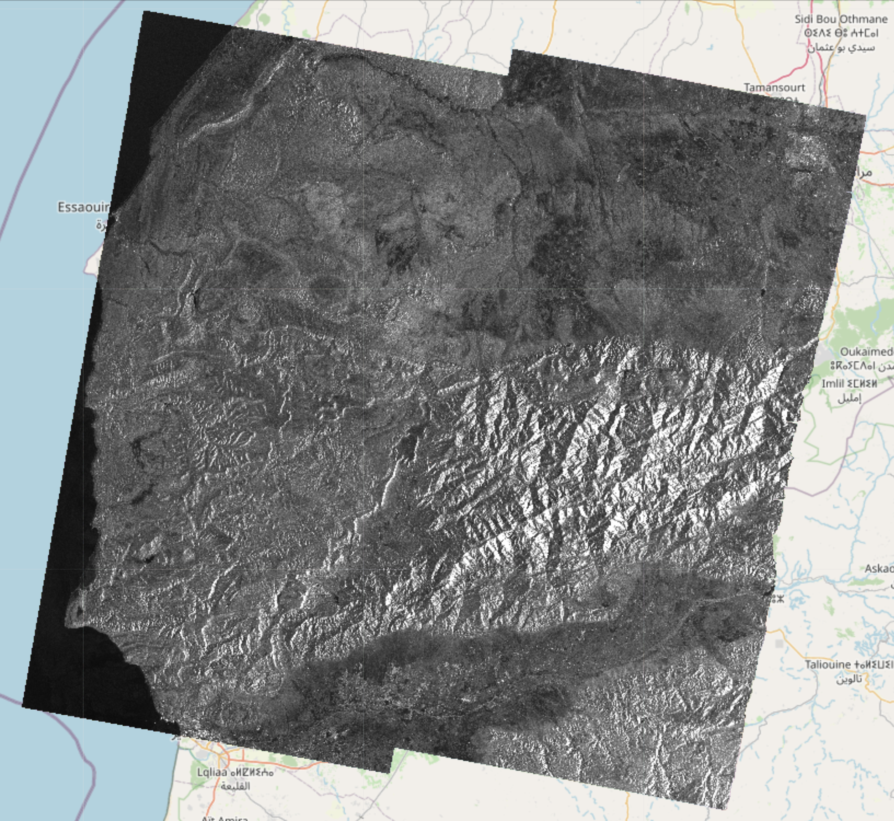
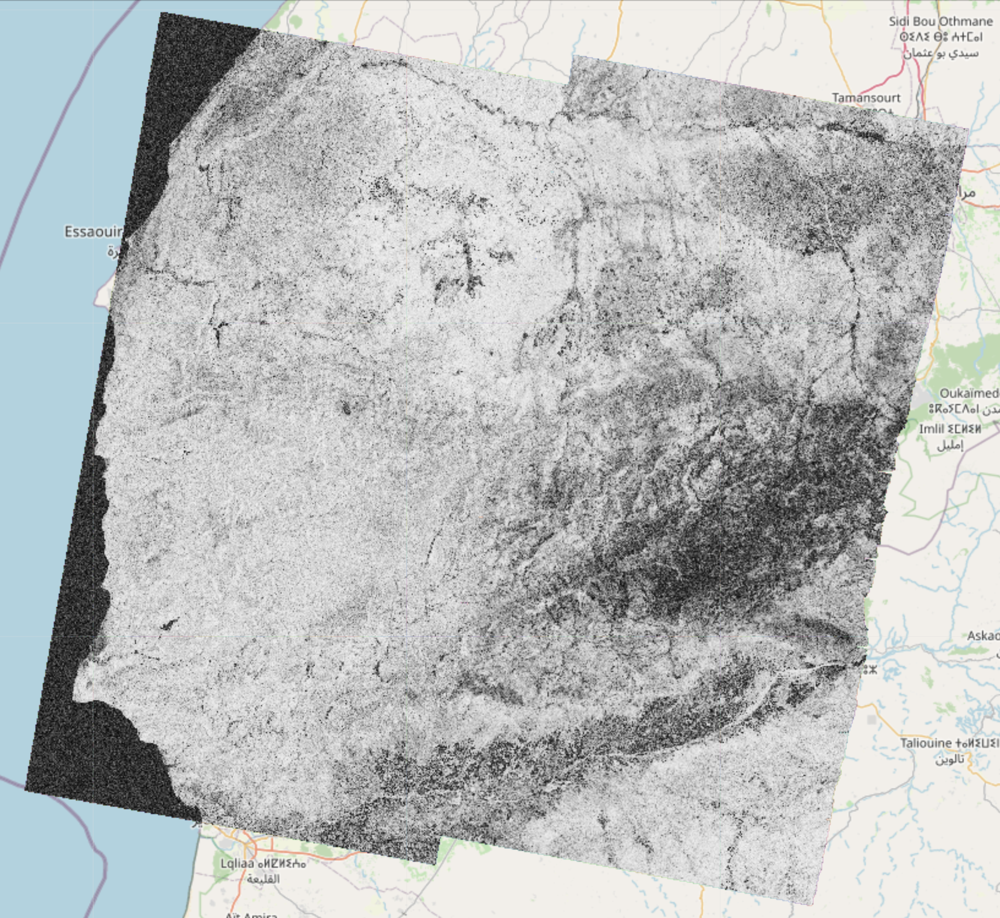

# EO-Tools: 

A dockerized toolbox for easy programmatic processing of remote sensing imagery from various public sources.

## New feature: standalone TOPS InSAR processor
- **Bursts from Sentinel-1 TOPS InSAR pairs can now be processed and combined without using SNAP.**
- A new processor for IW subswath can be used -- see `s1-easy-tops-insar.ipynb` in the `notebook` folder.
- Bursts can also be processed individually using the `S1.core` module for more flexibility. Results can be further processed as in-memory arrays or written as GeoTiff files. An example of such processing is found in `s1-tops-core-demo.ipynb`
- More features/improvements will be added in the near future such as:
    - Better memory and multi-core handling (probably using `dask`)
    - Full product (all subswaths and polarization) processing with optional AOI selection
    - Multi-temporal stacks
    - Radiometric terrain correction
- In a more distant future:
    - Tools for change detection, polarimetry, speckle filtering, DEM generation

Here are examples of amplitude, phase and coherence computed using this framework:
<p float="left">
    
    
    
</p>

## Overview
- Because this project is in active development the API is likely to change. 
- Currently, the available features are:
    - Sentinel-1
        - New standalone InSAR processor (see previous section)
        - Legacy InSAR processor (running SNAP graphs through PyroSAR) computing the coherence, phase and intensities of an interferometric pair of SLC products
        - Write the result as a geocoded (terrain corrected) COG (Cloud Optimized GeoTIFF) file
        - Display these rasters on top of a folium map in a jupyter notebook
    - Sentinel-2
        - Tile merging and geocoding
        - Write any band to COG files
        - Visualization of color composites (Natural RGB, CIR, SWIR, etc) on a folium map
    - DEM
        - Automatically downloads and crops a DEM given a geometry 
    - All products
        - Search catalog (using EODAG) and download products
        - Explore products by displaying their footprint on a folium map (custom function)
        - Show remote and local images on top of folium maps in the notebook
- Example notebooks can be found in the `notebooks/` folder

## Install & usage

- The package comes in two flavors
    - A conda package that contains the main functionality (Sentinel-1 InSAR, Sentinel-2 tile mosaic and DEM download)
    - A docker container (for more advanced users) that also works with a TiTiler server for interactive visualization in the notebooks
    - The legacy SNAP based processor is also only available in the docker version.

### Conda

- It is recommended to first create a conda environment to avoid package conflicts

```bash
conda env create -n eo_tools
conda activate eo_tools
conda install conda-forge::eo_tools
```

### Docker

- It works as a dev container for VSCode. 
    - Clone into the location of your choice.
    - Volumes paths can (and should) be changed in `docker-compose.yml`.
    - After opening the main directory, VSCode should detect the devcontainer file and ask to build the container. Once the container is running, the example notebooks can be used.
- Alternatively, it should also be possible to start the container from the main directory with `docker-compose up -d` in a terminal and attach to the container with any editor supporting docker.

### Getting started

- Please make sure `jupyter` is installed in your environment
- Example jupyter notebooks demonstrate the different features
- For conda use the notebooks in the `notebooks-cf` directory
- For docker use the notebooks in the `notebooks` directory

## Notice

- This project was originally forked from: https://github.com/eo2cube/s1_processor/, however since 99% of the code is now original, I have detached the fork.
- Visualization functions are using TiTiler https://developmentseed.org/titiler/
- Product discovery and download are using EODAG https://github.com/CS-SI/eodag
- The old S1 processor uses pyroSAR https://github.com/johntruckenbrodt/pyroSAR which executes graphs with ESA's SNAP software https://github.com/senbox-org
